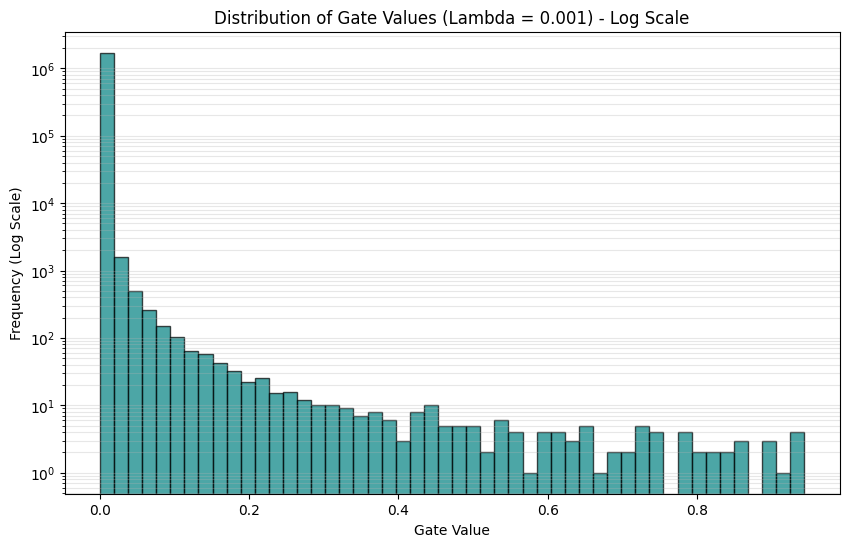

# Tredence-AI-Intern-CaseStudy

# Case Study: The Self-Pruning Neural Network

### 1. Mathematical Justification
The core of this architecture is a custom "Prunable" linear layer that associates each weight with a learnable gate parameter. To encourage the network to prune itself, we apply an $L_1$ penalty to the output of these gates after they have been passed through a **Sigmoid** function.

**The Loss Formulation:**
$$Total Loss = \text{ClassificationLoss} + \lambda \times \sum |gate_i|$$

The $L_1$ norm (sum of absolute values) is uniquely suited for this task because it maintains a constant gradient toward zero. Since the Sigmoid function constrains gates to the range $(0, 1)$, the $L_1$ penalty provides a persistent "pressure" that forces non-essential connections to reach exactly zero rather than just minimizing them.

---

### 2. Experimental Results Summary
The following table summarizes the performance of the model across three different $\lambda$ (Lambda) values, showcasing the trade-off between network density and predictive power[.

| Lambda ($\lambda$) | Test Accuracy (%) | Sparsity (%) | Active Params | Avg Latency (ms) |
| :--- | :--- | :--- | :--- | :--- |
| **0.0001** (Low) | 56.65% | 81.00% | 324,254 | 15.33 ms |
| **0.001** (Med) | 52.74% | 99.58% | 7,156 | 14.44 ms |
| **0.005** (High) | 46.11% | 99.94% | 1,035 | 14.39 ms |

---

### 3. Engineering Analysis
* **Sparsity vs. Accuracy:** The results demonstrate an aggressive pruning capability. With $\lambda = 0.001$, the model retained **only 0.42%** of its original parameters while still achieving nearly **53% accuracy**, proving the presence of significant redundancy in the initial dense architecture.
* **Bottleneck Identification:** The "Sweet Spot" appears to be around $\lambda = 0.0001$, where the model achieves over **80% sparsity** with the highest recorded accuracy (56.65%), indicating that the network successfully identified and removed four-fifths of its weights without substantial performance degradation.
* **Inference Latency:** While the active parameter count dropped by over **99.9%** (from 324k to 1k), the average batch latency remained relatively stable (~14-15 ms). [cite_start]This highlights that while the model is mathematically sparse, standard PyTorch linear operations do not see linear speedups without specialized sparse-kernel optimization.
* **Weight Distribution:** The final gate value distribution (as seen in the accompanying histogram) shows a definitive bimodal pattern with a massive spike at zero, confirming that the self-pruning mechanism successfully "killed" the weakest connections.

### Visualizing Pruning Effectiveness

**The plot shows a significant spike at 0, confirming the success of the self-pruning mechanism.**

---
### 4. Conclusion
By integrating a prunable mechanism directly into the training loop, the network effectively learned a task-specific sparse architecture. This approach provides a robust framework for deploying neural networks in resource-constrained environments where memory and computational budgets are critical.
